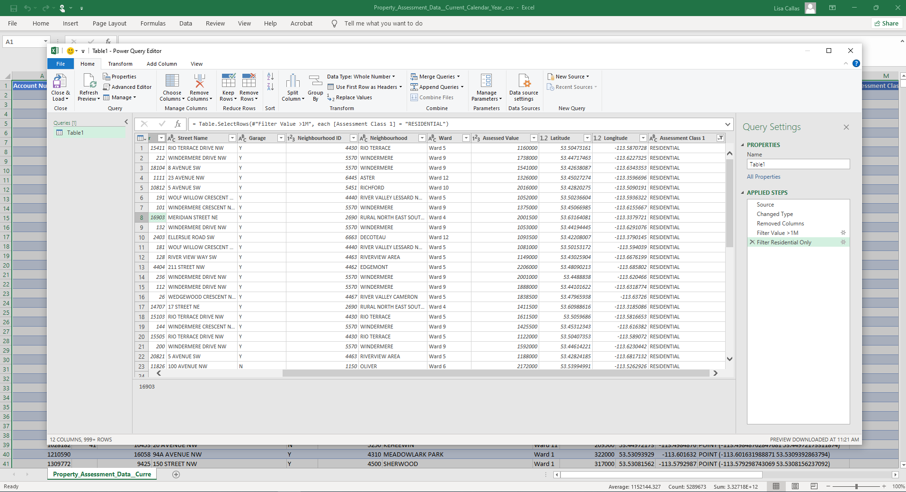

# Webinar Goals:

## Hour 1

- To understand what data analytics is and how the various tools and methodologies relate to the definition

- To understand the difference between a coding approach and a non-coding approach and the pros and cons of each

- To explore some examples of analyses and visualizations that can be generated using advanced analytics software (RStudio)

## Hour 2:
- To practice hands-on coding in a workshop environment using RStudio

---
class: center, top
# __POLL__
##Where do you see yourself?

###1. Beginner
###2. Confident
###3. Skilled
###4. Advanced
---
class: center, middle

# What is data analytics?

The process of analyzing raw data to find trends and answer questions
---
#Examples:
How many citizens used the City recreation centres last month?

Is there a gender pay gap in the organization?

Did the business area achieve their performance targets?

Which safety inspections are high risk and should be prioritized?

Are there any suspicious employee expense claims?

What are the key risks the organization may be facing in the next 5 years?

Why does the business permitting process take so long?

Are City services distributed equitably to all citizens?


---
class: center, middle

#* ...so what is advanced analytics?*

Refers to the sophistication or complexity of the tools and techniques used for data analysis.

---

class: left, middle

# Basic Analysis

### - Spreadsheets (Excel, Google Sheets)
### - Column/row summaries and calculations
### - Grouping and sorting
### - Basic calculation and functions (sum, average)
### - Templated graphs and charts for data exploration

.center[]

---
class: left, middle

# Mid-Level Analysis

### - Out-of-the-box analytic software
(Tableau, Excel Power Query, Google Data Studio, Stata, ACL)
### - Built-in complex analytic functions
### - Multi-factor grouping and segmenting
### - Optional or recommended coding skills

.center[]
---
#Example:
.center[]
---
# With Power Query:

.center[]
---

class: left, middle

# Advanced Analysis

### - Programming language & coding (Python, R, SQL, etc)
### - User or crowd-sourced functions and packages
### - Complex data management and analytics (big, messy datasets, predictive analyses)
### - Fully reproduceable and documented

.center[]
---
#In RStudio:

```{r warning=F, message=F, echo=F}
options(scipen = 6, digits = 4) #non-scientific notation

library(tidyverse)
```

```{r warning=F, message=F}
data <- read_csv("PA_Data.csv")

data %>% 
  filter(`Assessed Value` > 1000000,
         `Assessment Class 1` == "RESIDENTIAL") %>% 
  summarize(Total=n())
```

---
#Excel Spreadsheet
.center[]
---
#Excel Power Query
.center[]
---
#RStudio
```{r warning=F, message=F}
data <- read_csv("PA_Data.csv")

data %>% 
  filter(`Assessed Value` > 1000000,
         `Assessment Class 1` == "RESIDENTIAL") %>% 
  summarize(Total=n())
```

---
class: center, middle
# Mindset Shift

---

class: center, middle
# Attendance Check


---
## *Why should I learn to code?*


 - Development of logic and problem solving skills
 
 
 - Deeper toolbox
 
 
 - Documentation
 
 
 - Advancement

---

class: center, middle
#Scenario

---
# Picking a Language

```{r, out.width='50%', fig.align='left', echo=F}
knitr::include_graphics('https://d33wubrfki0l68.cloudfront.net/57299a1dcd979c623325f11bf5e5ce60f3d4eb00/e4602/wp-content/uploads/2018/10/black.png')

```


```{r, out.width='60%', fig.align='right', echo=F}
knitr::include_graphics('https://www.python.org/static/community_logos/python-logo-master-v3-TM-flattened.png')
```

---
class:top, left
# Data Wrangling

.centre[]

.footnote[ 
.small[
*Artwork by @allison_horst*
]]
---
# Tidy Data

.center[]

.footnote[ 
.small[
*Artwork by @allison_horst*
]]
---
# Tidy Data

.center[]

.footnote[ 
.small[
*Artwork by @allison_horst*
]]
---

# Untidy Data

.left[]
---

# More Untidy Data
.center[]
---
# Untidy Data

```{r echo=F, message=F, error=F, warning=F}

#Data was originally imported from a google sheet. I used datapasta::dpasta function to allow for reproducibility.

FTE_data <- tibble::tribble(
                                              ~Bus_Area,  ~`2017`, ~`2018`,  ~`2019`,  ~`2020`,  ~`2021`,
                                           "Operations",    9331,   9510,    9875,    9926,    9954,
                                   "Financial Services",  186.62,  190.2,   197.5,  198.52,  199.08,
                                      "Human Resources", 130.634, 133.14,  138.25, 138.964, 139.356,
                               "Information Technology", 102.641, 104.61, 108.625, 109.186, 109.494
                               )


tidy_data <- tibble::tribble(
                    ~Bus_Area,  ~Year,  ~AveSal,    ~FTE,       ~Budget,
                 "Operations", "2017",    45000,    9331,     419895000,
                 "Operations", "2018",    49500,    9510,     470745000,
                 "Operations", "2019",    54450,    9875,     537693750,
                 "Operations", "2020",    59895,    9926,     594517770,
                 "Operations", "2021",  65884.5,    9954,     655814313,
         "Financial Services", "2017",    65000,  186.62,      12130300,
         "Financial Services", "2018",    71500,   190.2,      13599300,
         "Financial Services", "2019",    78650,   197.5,      15533375,
         "Financial Services", "2020",    86515,  198.52,    17174957.8,
         "Financial Services", "2021",  95166.5,  199.08,   18945746.82,
            "Human Resources", "2017",    63000, 130.634,       8229942,
            "Human Resources", "2018",    69300,  133.14,       9226602,
            "Human Resources", "2019",    76230,  138.25,    10538797.5,
            "Human Resources", "2020",    83853, 138.964,  11652548.292,
            "Human Resources", "2021",  92238.3, 139.356, 12853960.5348,
     "Information Technology", "2017",    72000, 102.641,       7390152,
     "Information Technology", "2018",    79200,  104.61,       8285112,
     "Information Technology", "2019",    87120, 108.625,       9463410,
     "Information Technology", "2020",    95832, 109.186,  10463512.752,
     "Information Technology", "2021", 105415.2, 109.494, 11542331.9088
     )
```

I imported my untidy data from a Google Sheet without making any changes to it
```{r, echo=T, message=F, warning=F}

FTE_data

```
---
# Tidy!

```{r echo=T, message=F, error=F, warning=F}

long_data <- FTE_data %>% 
                pivot_longer(cols = -c(Bus_Area), 
                             names_to = "Year", 
                             values_to= "FTE")

head(long_data, 10)

```
---
# How have costs changed?

```{r, fig.height=4, fig.width=10}
tidy_data %>% 
  group_by(Year) %>% 
  summarize(Budget= sum(Budget)) %>% 

ggplot(aes(x=Year, y=Budget, group=1))+
  geom_line()->by_Year_line

by_Year_line
```
---
# By business area? 


```{r, fig.height=6, fig.width=10}
ggplot(tidy_data, aes(x=Year, y= Budget, group= Bus_Area, colour= Bus_Area))+
  geom_line()
  
```
---
# Those can be hard to see...


```{r, fig.height=6, fig.width=10}
ggplot(tidy_data, aes(x=Year, y= Budget, group= Bus_Area))+
  geom_line()+
  facet_wrap(~Bus_Area, ncol = 2, scales = "free")
  
```


---
# Plots and Graphs
- All plots and graphs are fully customizable. 

- Because they are built on code rather than manual manipulation (like Excel), 
if the data changes, it is very simple to update visualizations.


.center[]

---
# Relationships
- Network diagrams plot out how closely related different entities are.  

- We can make a diagram that visualizes how often staff work with each other.

.center[]
---
# Maps
- You can plot locations on a map with R.

- This is an map of all sandbox locations in the City of Edmonton.

.center[]

---
# Next Steps...

## Make a learning plan!

 - Find a mentor
 
 - Find an online class
 
 - Find an in-person class
 
 - Find a supportive user group

---

# Resources
- R for Data Science (online book)

- RStudio Cheat Sheets

- Twitter (@rstudiotips, @rweekly_org, @R-LadiesGlobal, @WeAreRLadies, @drob, @Rbloggers, @RLangTip, #rstats)

- YouTube

- Stack Overflow

- RStudio education

---

class: center, middle

# Final Attendance Check

 
